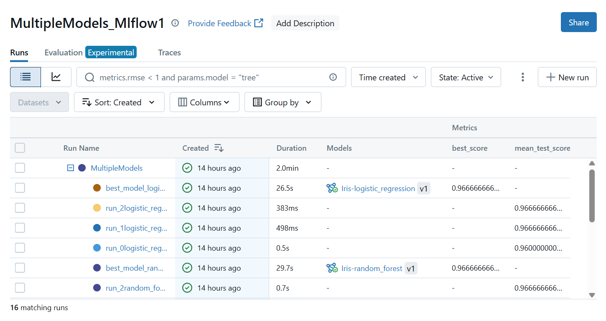
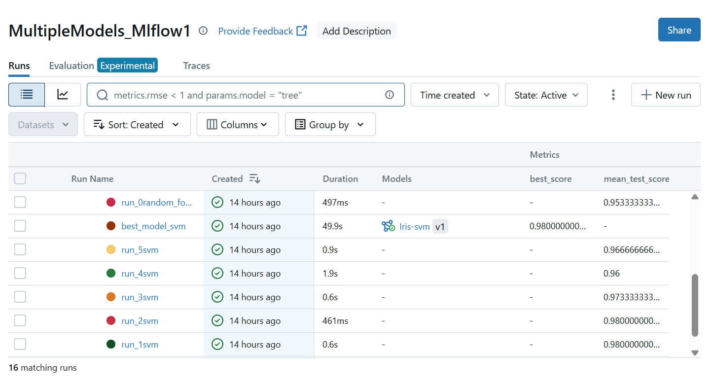
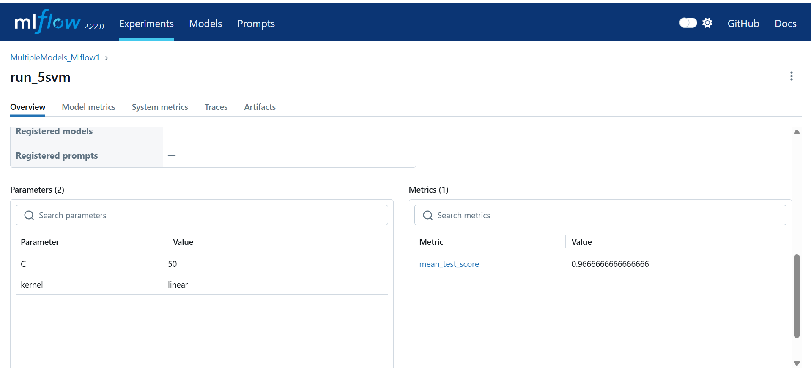
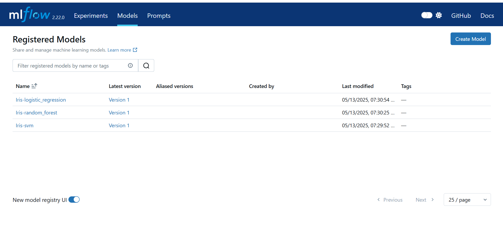
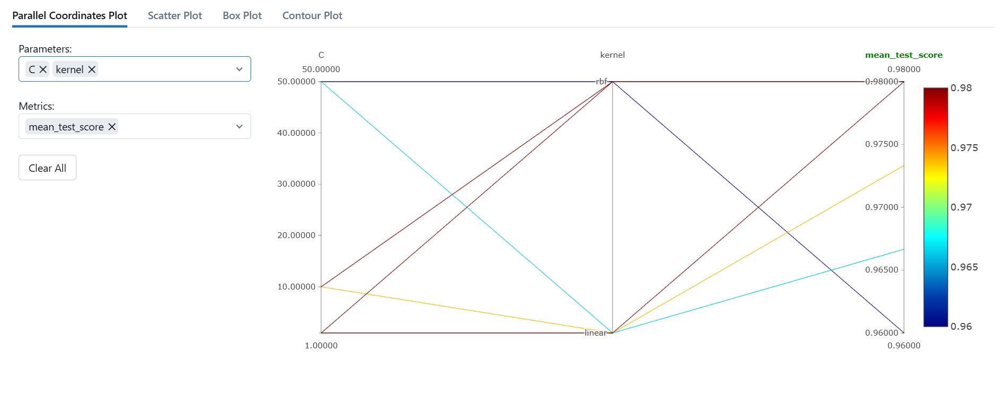
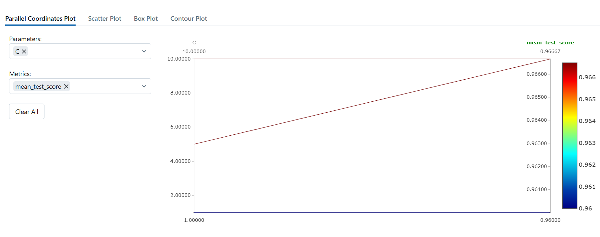
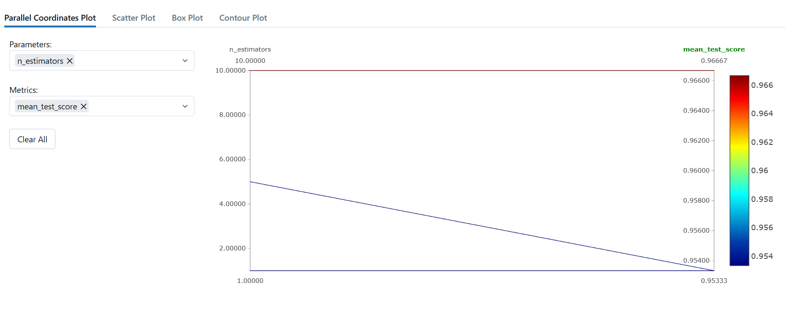

# 🧠 Multi-Model Training & Tracking with MLflow on the Iris Dataset

This project demonstrates the end-to-end process of training and evaluating **multiple machine learning models** on the classic **Iris dataset**, with automated tracking of hyperparameters, metrics, and models using **MLflow**.

---

## 🔍 Problem Statement

The goal is to identify the best classification model for predicting the Iris species based on sepal and petal measurements. We compare three popular models:

- **Support Vector Machine (SVM)**
- **Random Forest Classifier**
- **Logistic Regression**

Each model is trained using **GridSearchCV** to find the optimal hyperparameters, and results are logged and tracked using **MLflow**.

---

## ⚙️ Workflow & Process

### 1. **Dataset Loading**
- Uses `sklearn.datasets.load_iris()` to load the Iris dataset.
- Dataset contains 150 samples with 4 features each: sepal length, sepal width, petal length, petal width.

### 2. **Model Selection and Parameter Grid**
Three models are selected, each with a hyperparameter grid:

| Model               | Hyperparameters                      |
|---------------------|---------------------------------------|
| SVM                 | C: [1, 10, 50], kernel: [rbf, linear] |
| Random Forest       | n_estimators: [1, 5, 10]              |
| Logistic Regression | C: [1, 5, 10]                         |

### 3. **Hyperparameter Tuning with GridSearchCV**
- Performed 5-fold cross-validation (`cv=5`)
- `GridSearchCV` searches through all combinations of hyperparameters
- Accuracy score (`mean_test_score`) is used as evaluation metric

### 4. **MLflow Logging**
- **Nested MLflow runs** are used to log each hyperparameter trial
- Logs include:
  - Model name
  - Hyperparameters used
  - Cross-validation accuracy (`mean_test_score`)
- **Best model** for each algorithm is:
  - Logged separately
  - Registered in MLflow Model Registry

---

## 🧪 How to Run

1. Start MLflow tracking UI:
   ```bash
   mlflow ui
Run the training script:

python multiple_model_hyperparameter.py
View the MLflow UI at:

http://127.0.0.1:5000
📸 Results & Screenshots
🔹 MLflow Experiment Page




🔹 Hyperparameter Trial


🔹 Registered Best Models

Final models registered in MLflow Model Registry.


SVM Parallel Coordinates Plot


Logistic Regression Parallel Coordinates Plot


Random Forest Parallel Coordinates Plot



📈 Results Summary
| Model | Best Accuracy | Best Parameters |
|-------|--------------|----------------|
| SVM | 0.98 | C=1, kernel='rbf' |
| Random Forest | 0.966 | n_estimators=10 |
| Logistic Regression | 0.966 | C=5 |


SVM  achieved the highest accuracy (0.98)


🧠 Observations
SVM with rbf kernel was highly effective for this linearly separable dataset.

Logistic Regression performed nearly identically to Random Forest, which is expected due to similar decision boundaries.

Random Forest did well but might be more suitable for larger, more complex datasets.

MLflow's nested runs made it easy to track hyperparameter tuning across models.

Model Registry is useful for versioning and deployment readiness.


🛠️ Dependencies
mlflow
scikit-learn
pandas
openpyxl
Install with:

pip install -r requirements.txt

